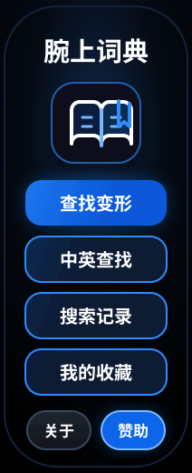

<p align="center">
  
</p>

<h1 align="center">腕上词典</h1>

<p align="center">
  <em>小米手环上的离线词典 — 抬手即查，无需掏手机</em>
</p>

<p align="center">
  
  
  
  
  
  
  
</p>

---

## 简介

**腕上词典** 是一款运行在小米手环上的 Vela 快应用，把一部完整的英汉词典装进手腕。查英语单词、汉字、动词变形——全程离线，抬手即用。

基于小米 `aiot-toolkit` 开发，内置 **14,942 条词汇**（数据源：ECDICT + BNC/COCA 词族），全面适配胶囊屏、iWatch 屏和 466 圆屏。

---

## 功能

- **🔍 三种查词模式** — 英语精确/前缀匹配、汉字查词、动词/形容词变形反查
- **⌨️ 完整输入法** — 全键盘英文输入，支持光标编辑、自动补全，三击搜索框展开大键盘
- **✨ 智能补全** — 按字母分桶的英语建议列表，标注考试等级（中考/高考/CET-4/CET-6/考研/TOEFL/IELTS/GRE）
- **🌀 模糊搜索** — 基于编辑距离的容错匹配（最多 2 个差异），输错也能找到
- **📖 变形查词** — 输入 `ran` → 找到 "run"，输入 `better` → 找到 "good"
- **❤️ 收藏与历史** — 收藏容量 150 条，支持 A-Z 字母分类筛选，分页加载
- **📄 分页结果** — 搜索结果分页展示 + 动态增量渲染，翻页自动滚屏
- **📱 多屏适配** — 胶囊屏 / iWatch 屏 / 466 圆屏，每个页面按屏幕布局自适应排版
- **🌙 深色主题** — 深蓝底色 `#020813` + 蓝色强调 `#1d74e8`，暗光下不刺眼
- **📦 纯离线** — 词典数据内置于应用，无需网络

---

## 页面

| 页面 | 路由 | 说明 |
|------|------|------|
| **首页** | `pages/index` | 入口 — 4 个主按钮 + 关于 / 赞助 |
| **搜索** | `pages/search` | 输入法输入、光标编辑、自动补全 |
| **结果** | `pages/results` | 英文/中文查词结果 |
| **详情** | `pages/detail` | 单词释义、变形、收藏切换 |
| **记录** | `pages/records` | 历史记录 / 收藏列表（参数区分） |
| **关于** | `pages/about` | 致谢、版本、许可信息 |
| **赞助** | `pages/sponsor` | 赞赏码 |

---

## 快速开始

```bash
# 安装依赖
npm install

# 启动开发服务器（热重载）
npm run start

# 构建生产包
npm run build

# 发布构建（压缩 + 签名）
npm run release

# 代码检查
npm run lint
```

### 部署到手环

```bash
# 构建并推送到模拟器（默认）
npm run deploy:watch

# 推送到真机
npm run deploy:watch -- -Serial 192.168.x.x:5555

### 多分辨率安装包

项目通过条件编译生成五个目标包：192×490、212×520、336×336、432×432、466×466。

```powershell
npm run build:resolutions
```

产物位于 `dist/resolutions/`，其中 `manifest.json` 记录每个包的目标宽度和 SHA-256。安装时请根据设备屏幕宽度选择对应的 `.rpk`。

# 仅推送已有 RPK，跳过构建
npm run deploy:watch:fast
```

---

## 项目结构

```
src/
├── app.ux                        # 应用生命周期
├── manifest.json                 # 路由、特性声明、权限
├── pages/
│   ├── index/                    # 首页
│   ├── search/                   # 搜索（输入法 + 光标编辑）
│   ├── results/                  # 英/中查词结果
│   ├── detail/                   # 单词详情 + 收藏
│   ├── records/                  # 历史 / 收藏列表
│   ├── about/                    # 关于
│   └── sponsor/                  # 赞赏
├── components/
│   └── InputMethod/              # 英文输入法（全键盘 + 光标控制）
├── common/
│   ├── dict/                     # 紧凑词典分片（自动生成，请勿手动编辑）
│   └── logo.png                  # 应用图标
├── i18n/                         # 国际化文件（zh-CN, en, defaults）
scripts/
├── deploy_watch.ps1              # ADB 部署脚本
└── generate_watch_dict.py        # 词典生成器（从 ECDICT 生成）
```

---

## 词典架构

离线词典引擎针对手环场景设计——低内存、快速启动、无数据库。

| 组件 | 说明 |
|------|------|
| **英文索引** | 26 个 `words/word_<a-z>.txt`；每行 `word<TAB>entryId<TAB>tag` |
| **中文索引** | 按 Unicode `codepoint % 64` 分 64 桶；ID 列表用递增差值 + base36 严格解码 |
| **变形索引** | `key_for()` 的 2 字符分片仅用于 `inflect/` 与 `inflect_reverse/` |
| **词条存储** | `entries/entry_<nn>.txt` 按 `entryId / 500` 分片，是英/中文结果补全的唯一完整词条数据 |
| **自动补全** | 异步读取并缓存同一份紧凑英文索引；考试标签参与排序 |
| **模糊搜索** | 扫描紧凑英文索引（≤4000 词、候选池 80），再按 `entryId` 补全完整词条 |

> **14,942 条词汇**，源自 ECDICT + BNC/COCA 词族频率数据。

不再打包 `index_en.txt` 或 `english_suggestions.js/.json`。compact-v3 优化后 RPK 约 2.8 MiB。

### 重新生成词典

```bash
python scripts/generate_watch_dict.py
```

数据来源：`data/ecdict_tagged_14942_compact.csv` + `data/cedict.txt.gz` + 可选 `data/bnc_coca_word_family_lists_v2.xlsx`。

---

---


## 技术栈

| 层级 | 技术 |
|------|------|
| **框架** | Xiaomi Vela QuickApp (`.ux` SFC) |
| **工具链** | `aiot-toolkit` v2.0.5 / `rspack` v1.7.12 |
| **运行时** | Vela JS Engine（JSC 字节码） |
| **屏幕** | 胶囊屏 / iWatch 屏 / 466 圆屏三端适配，`designWidth: device-width` |
| **存储** | `@system.storage`（JSON） |
| **路由** | `@system.router`（7 页面） |
| **代码检查** | ESLint + Prettier + Stylelint |
| **提交规范** | Commitlint（约定式提交） |
| **部署** | ADB push + `pm install` |

---

## 代码规范

- 无分号 · 双引号 · 无尾逗号 · `bracketSpacing: false`
- 行宽 100 · 2 空格缩进
- 约定式提交：`feat:`、`fix:`、`style:`、`refactor:`、`docs:` 等
- 禁止 `as any` / `@ts-ignore` / 空 catch 块

---

## 版本历史

详见 [CHANGELOG.md](CHANGELOG.md)。

| 版本 | 日期 | 亮点 |
|------|------|------|
| **2.2.0** | 2026-07-18 | 收藏重构（150条+A-Z分类）、大键盘输入、结果分页 |
| **2.1.0** | 2026-07-17 | 多屏适配完成、compact-v3 词典、详情页增强 |
| **2.0.0** | 2026-07-14 | 词典体积压缩 ~60%、多屏布局适配 |
| **1.0.0** | 2026-07-08 | 初始发布：查词、输入法、收藏历史 |

---

## 许可

腕上词典是开源的手腕伴侣。词库数据来自 [ECDICT](https://github.com/skywind3000/ECDICT)。

---

<p align="center">
  <sub><a href="https://github.com/pcai7296/wrist-dictionary">GitHub 仓库</a></sub>
</p>
