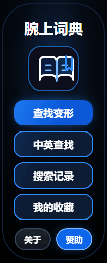

<p align="center">
  
</p>

<h1 align="center">腕上词典 · Wrist Dictionary</h1>

<p align="center">
  <em>A full-featured English–Chinese dictionary app for Xiaomi Band — right on your wrist.</em>
</p>

<p align="center">
  
  
  
  
  
</p>

---

## Overview

**腕上词典** (Wrist Dictionary) is a Xiaomi Vela Quick App that turns your Mi Band smartwatch into a pocket dictionary. Look up English words, Chinese characters, inflected verb forms, and Japanese text — all without pulling out your phone.

Built with Xiaomi's `aiot-toolkit`, it packs an offline dictionary of **14,942 headwords** from ECDICT (enriched with BNC/COCA word-family data) into a 212×520 canvas optimized for the wrist.

---

## Features

- **🔍 Three Search Modes** — English word lookup (exact + prefix), Chinese character search (via Pinyin input), and inflected form reverse lookup
- **⌨️ Full Input Method** — QWERTY keyboard, T9 input, Chinese Pinyin IME, and Japanese Romaji→Kana conversion — adapts to pill-shaped, round, and rectangular screens
- **✨ Smart Autocomplete** — Letter-indexed English suggestions tagged by exam level (中考/高考/CET-4/CET-6/考研/TOEFL/IELTS/GRE)
- **🌀 Fuzzy Search** — Edit-distance based matching (max 2 edits) over 14k+ headwords, perfect for typos
- **📖 Inflected Form Lookup** — Type `ran` → find "run", type `better` → find "good"
- **❤️ Favorites & History** — Save up to 20 favorite words; view and replay recent searches
- **🌙 Dark Theme** — Deep navy background (`#020813`) with blue accent (`#1d74e8`) — easy on the eyes in any light
- **📦 Fully Offline** — Dictionary data ships with the app. No network required.

---

## Screenshots



> Home screen with the open-book icon and main navigation: Inflect Search, English/Chinese Search, History, and Favorites.

---

## Pages

| Page | Route | Description |
|------|-------|-------------|
| **Home** | `pages/index` | Entry point — 4 main buttons + About / Sponsor |
| **Search** | `pages/search` | Text input with IME, cursor editing, autocomplete |
| **Results** | `pages/results` | Search results (English + Chinese lookup) |
| **Detail** | `pages/detail` | Word detail with definition, examples, favorite toggle |
| **Records** | `pages/records` | Browse history or favorites list (type param) |
| **About** | `pages/about` | Credits, version, license info |
| **Sponsor** | `pages/sponsor` | Donation QR code |

---

## Quick Start

```bash
# Install dependencies
npm install

# Start dev server with hot-reload
npm run start

# Build for production
npm run build

# Release build (minified + signed)
npm run release

# Lint all source files
npm run lint
```

### Deploy to Watch

```bash
# Build and push to emulator (default)
npm run deploy:watch

# Push to real device
npm run deploy:watch -- -Serial 192.168.x.x:5555

# Skip build, push existing RPK only
npm run deploy:watch:fast
```

---

## Project Structure

```
src/
├── app.ux                        # App lifecycle (onCreate/onDestroy)
├── manifest.json                 # Router, features, permissions
├── pages/
│   ├── index/                    # Home — entry page
│   ├── search/                   # Search with IME, cursor editing
│   ├── results/                  # English + Chinese results
│   ├── detail/                   # Word detail + favorite toggle
│   ├── records/                  # History / Favorites list
│   ├── about/                    # Credits & license
│   └── sponsor/                  # Donation QR code
├── components/
│   └── InputMethod/              # Full IME (QWERTY/T9, CN/EN/JP, 3 screen shapes)
├── common/
│   ├── dict/                     # Dictionary shards (generated, do not edit)
│   ├── english_suggestions.js    # Letter-indexed autocomplete word lists
│   └── logo.png                  # App icon
├── i18n/                         # i18n locale files (zh-CN, en, defaults)
scripts/
├── deploy_watch.ps1              # ADB deploy helper
└── generate_watch_dict.py        # Dictionary generator from ECDICT
```

---

## Dictionary Architecture

The offline dictionary engine is designed for smartwatch constraints — minimal memory, fast startup, no database.

| Component | Description |
|-----------|-------------|
| **English Index** | Words sharded by 2-char prefix key. Single-letter queries use `index_en.txt` map |
| **Chinese Index** | Chinese characters indexed by Unicode `codepoint % 64` into 64 bucket files |
| **Inflect Index** | Inflected forms → headword mapping via sharded reverse index |
| **Entry Store** | Entry data sharded by `entryId / 500`, used by Chinese search path |
| **Fuzzy Search** | Bounded edit-distance scan (max 2) over shard files, up to 4000 words scanned, 80 candidate pool |

> **14,942 headwords** from ECDICT, enriched with BNC/COCA word-family frequency data.

### Regenerate Dictionary

```bash
python scripts/generate_watch_dict.py
```

Sources: `data/ecdict_tagged_14942_compact.csv` + optional `data/bnc_coca_word_family_lists_v2.xlsx`.

---

## Input Method (IME)

The `InputMethod` component supports three screen shapes and three languages:

- **Screen shapes**: `pill-shaped` (default), `circle` (480×321 keyboard area), `rect`
- **Keyboard layouts**: QWERTY (full) and T9 (predictive)
- **Languages**: English, Chinese (Pinyin→Hanzi), Japanese (Romaji→Kana)

Powered by `dicUtil.js` orchestrating:
- `dic.js` — Pinyin-to-Hanzi mapping
- `dic_jp.js` — Romaji-to-Kana/Kanji mapping

---

## Tech Stack

| Layer | Technology |
|-------|------------|
| **Framework** | Xiaomi Vela QuickApp (`.ux` SFC) |
| **Toolchain** | `aiot-toolkit` v2.0.5 / `rspack` v1.7.12 |
| **JS Runtime** | Vela JS Engine (JSC bytecode) |
| **Screen** | 212×520px, `designWidth: device-width` |
| **Storage** | `@system.storage` (JSON) |
| **Router** | `@system.router` (7 pages) |
| **Linting** | ESLint + Prettier + Stylelint |
| **Commit** | Commitlint (conventional commits) |
| **Deploy** | ADB push + `pm install` |

---

## Code Conventions

- No semicolons · Double quotes · No trailing commas · `bracketSpacing: false`
- Print width 100 · 2-space indent
- Conventional commits: `feat:`, `fix:`, `style:`, `refactor:`, `docs:`, etc.
- No `as any` / `@ts-ignore` / empty catch blocks

---

## License

Built with ❤️ as an open-source wrist companion. Dictionary data sourced from [ECDICT](https://github.com/skywind3000/ECDICT).

---

<p align="center">
  <sub>Available on <a href="https://github.com/pcai7296/----">GitHub</a></sub>
</p>
